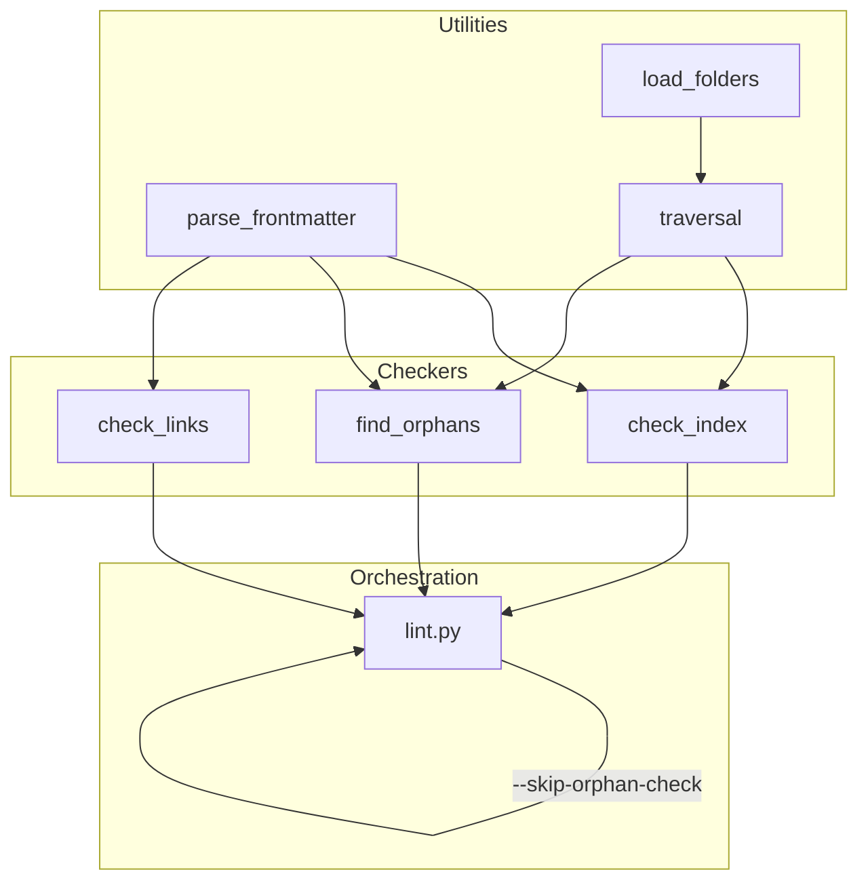

# Orphan Content Checker

Extracted from the Memory System Foundation plan. The orphan checker requires non-trivial refactoring of lint.py and warrants its own planning session.

## Problem Frame

lint.py's `check_index()` currently does a flat scan of `wiki/index.md` against all wiki pages. With per-category indexes (U3 of the foundation plan), page links live in `wiki/{category}/index.md`, not the master index. The current approach will report every wiki page as "index missing" because it won't find individual page links in the master index. Beyond the structural mismatch, there's no detection for category folders with content but no corresponding index entries — files that exist but aren't routed.

The typed links plan replaced the `source` frontmatter field with `IngestedFrom` links. The orphan checker needs to be rebuilt from scratch to use the new link structure.

## Summary

Refactor lint.py to extract `check_index()` and create `find_orphans()` as separate helper modules, add config-driven folder classification (working/system/excluded), support wikilinks in body link parsing, and add lint orchestration with `--skip-orphan-check`. Create shared frontmatter parsing and file traversal modules used by both checkers.

## Requirements

### Shared Logic

- S1. A shared traversal module scans all working and system directories and produces a list of all file paths
- S2. All files that PASS validation are removed from the list; remaining files indicate FAIL
- S3. The traversal module supports an `--indexed-only` flag that limits results to folders that have an associated index (any folder with an index file, including system folders like `.knap/` which use `ROUTER.md`)
- S4. Non-system and non-working folders are excluded folders
- S5. Working folders are defined in a config file as folders actively used by the user (includes `wiki/` by default)
- S6. System folders are defined in a config file as folders used by the Knap system (includes `.knap/` by default)
- S7. Excluded folders are defined in a config file as folders entirely excluded from processing (includes `.claude`, `.venv`, `.git`, `__pycache__`, `docs/brainstorms`, `docs/plans`, scripts, venvs, and any non-indexable content by default)
- S8. Folder classification config is extensible per-repo
- S9. Folder classifications are documented in `.knap/context/conventions.md`
- S10. A shared frontmatter parsing module is created as a helper, used by all scripts in this plan, and backported to remaining scripts in a deferred plan

### Specific To This Repo

- K1. `strategy.md` needs to move to context and is not to be renamed
- K2. `strategy.md` is a guiding document that should be included in any context where the system is being improved
- K3. `synthesis-memory-framework-design.md` is to stay in the `docs/` folder
- K4. Any files not already named in `docs/` need to move into the wiki under the `reference` category. Subfolders and their contents are excluded from this
- K5. Files that moved need to be indexed and any index entries that referred to them need to be removed or updated
- K6. `docs/brainstorms` and `docs/plans` are excluded folders
- K7. If any other subfolders appear in `docs/`, ask the user if they should be classified as excluded or working

### Index Checks

- I1. `check_index()` refactored into its own helper script called `check_index` that is called or imported by other scripts as needed
- I2. Existing logic unrelated to link validation that isn't superseded by anything else in this plan remains intact in the new script
- I3. Category index listing a page that doesn't exist is flagged (index ghost)
- I4. Master index missing a link to an existing category index is flagged
- I5. A file that exists within a working or system folder that does not have an index or router pointing to it is a FAIL
- I6. A file that exists within an indexed category needs to have a `Parent` link to its index in its frontmatter
- I7. A link from within the body of an index is considered a `Child` link type for reciprocity purposes
- I8. Indexes are the only file type that breaks the reciprocity rule: `index.md` (or `ROUTER.md`) is NOT required to have a `Child` link type in its frontmatter
- I9. The method that adds reciprocal links needs to be updated with this logic

### Orphan Checks

- O1. Existing `check_uningested()` (raw files without wiki pages) remains unchanged
- O2. `check_orphans()` refactored into its own helper script called `find_orphans` that can be called or imported by another script as needed
- O3. `find_orphans` returns a list containing the path of every file identified as an orphan
- O4. An orphan is defined as any file in a working or system folder that is not excluded by the folder classification config and does not have at least one file linking to it
- O5. Orphan checking parses the `links` frontmatter field and body links (source field is eliminated per completed migration)
- O7. Wikilinks (`[[Birthday Party]]`) without a pipe resolve to an exact filename match with `.md` extension, case-sensitive, searching the same category folder
- O8. Wikilinks with a pipe (`[[path|display]]`) are processed according to standard markdown link rules

### Lint Changes

- L1. `check_index` runs before `check_orphans` so that any orphans found are truly orphaned
- L2. If any orphans are found, stop, fail the lint, and ask the user how to proceed
- L3. Orphan handling options: go through each individually, defer to planning, or ignore and continue
- L4. If the user chooses to ignore, warn that leaving orphans can cause issues, then re-run with `--skip-orphan-check`
- L5. After any option, re-run the linting process
- L6. Add a `--skip-orphan-check` flag to `lint.py`

### Unit Testing

- T1. Every script created or modified in this plan must have corresponding unit tests
- T2. Unit tests use pytest with `tmp_path` and `monkeypatch` fixtures
- T3. Test files are colocated in `.knap/scripts/` as `test_<module>.py`
- T4. Test setup uses the `_setup_repo(tmp_path)` pattern with `monkeypatch.chdir(tmp_path)`

---

## Key Technical Decisions

### KTD-1. Script separation: extract to modules

Extract `check_index()` and `find_orphans()` into separate helper modules (`check_index.py`, `find_orphans.py`) rather than keeping them as functions in `lint.py`.

**Rationale:** The strategy doc mandates "single-use scripts" and "composed scripts call smaller ones." This matches the existing `check_links.py` pattern. Extraction enables independent testing, reuse by future scripts (e.g., `fix_orphans.py`), and clear separation: lint.py orchestrates, helpers execute.

**Trade-off:** More files to manage. Mitigated by clear module boundaries and import conventions.

### KTD-2. Folder classification: config-driven

Define folder classification (working/system/excluded) in `.knap/schema/folders.yaml` rather than hardcoding in scripts.

**Rationale:** Hardcoding violates "single source of truth." Config-driven classification allows per-repo customization, prevents classification drift between scripts, and supports the extensible design principle. The existing architecture already uses YAML config files (`categories.yaml`).

**Trade-off:** Adds a config file. Mitigated by sensible defaults that work out of the box.

### KTD-3. Wikilink resolution: exact filename match

Wikilinks (`[[Birthday Party]]`) resolve to exact filename match with `.md` extension, case-sensitive, searching within the same category folder.

**Rationale:** Deterministic and predictable. Aligns with Obsidian's wikilink behavior. Avoids ambiguity when same filename exists in different categories. Simple to implement and debug.

**Trade-off:** Less forgiving of typos. Users must use exact filenames.

### KTD-4. Orphan detection: file-system-first traversal

Scan all files in working/system folders first, then check which have incoming links.

**Rationale:** Indexes might be incomplete or missing. File-system-first catches files that should be indexed but aren't. Aligns with the "file exists → should be linked" mental model.

**Trade-off:** May flag intentionally unlinked files (e.g., drafts). Mitigated by clear criteria and user options.

### KTD-5. Shared traversal: common module

Extract shared traversal logic into a common module (`traversal.py`) that both `check_index.py` and `find_orphans.py` import.

**Rationale:** The traversal logic (S1-S3) is identical for both checks. Prevents duplication, ensures consistent classification, centralizes folder logic, and enables future checks to reuse.

**Trade-off:** Another module to maintain. Mitigated by clear interface design.

### KTD-6. Index reciprocity exception

Index files (`index.md`, `ROUTER.md`) are exempt from the reciprocity rule. They don't need `Child` links in frontmatter for pages they list in their body.

**Rationale:** Indexes are machine-maintained. Body links serve as the canonical child listing. Requiring frontmatter Child links doubles maintenance burden. Aligns with "script-first" principle.

**Trade-off:** Exception to the general rule. Mitigated by clear documentation and enforcement in `add_frontmatter_link()`.

### KTD-7. Frontmatter parsing: shared helper module

Extract frontmatter parsing into a shared `ParsedFile` class (`parse_frontmatter.py`) that reads the file once and exposes frontmatter, body, and error as properties. Used by all scripts in this plan, with a deferred plan to backport to remaining scripts.

**Rationale:** Frontmatter parsing is duplicated across 5 scripts with inconsistent return types. A shared class ensures consistent behavior, reads the file once, and eliminates return-type confusion. Creating it in this plan and backporting later avoids scope creep while establishing the pattern.

**Trade-off:** Two-phase rollout. Mitigated by the deferred plan being well-scoped.

### KTD-8. Unit testing: mandatory for all touched scripts

Every script created or modified in this plan must have corresponding unit tests using pytest.

**Rationale:** This is a hard requirement going forward. Tests prevent regressions, document expected behavior, and enable confident refactoring. The `_setup_repo(tmp_path)` + `monkeypatch.chdir(tmp_path)` pattern is already established.

**Trade-off:** Adds test code. Mitigated by tests being colocated and using established patterns.

---

## Implementation Units

### U1. Create frontmatter parsing helper

**Goal:** Extract frontmatter parsing into a shared module with consistent return type.

**Requirements:** S10, T1, T2, T3, T4

**Dependencies:** None

**Files:**
- `.knap/scripts/parse_frontmatter.py` — new: shared frontmatter parsing module
- `.knap/scripts/test_parse_frontmatter.py` — new: unit tests

**Approach:** A `ParsedFile` class that reads the file once on instantiation and exposes `frontmatter` (dict | None), `body` (str), and `error` (str | None) as properties. Handles the standard `---` delimited YAML block pattern. Body content is everything after the second `---`. Import `yaml` for parsing. Follow CWD-relative path convention.

**Immediate adopters:** All scripts created or modified in this plan. Remaining scripts are deferred to `docs/plans/2026-06-20-001-chore-backport-frontmatter-parser-plan.md`.

Usage:
```python
parsed = ParsedFile("wiki/transcripts/foo.md")
if parsed.error:
    # handle error
fm = parsed.frontmatter
body = parsed.body
```

**Test scenarios:**
- Valid frontmatter with body: `frontmatter` is dict, `body` is content, `error` is None
- Valid frontmatter with no body: `frontmatter` is dict, `body` is empty string, `error` is None
- Missing frontmatter: `frontmatter` is None, `error` describes the issue
- Unclosed frontmatter: `frontmatter` is None, `error` describes the issue
- Invalid YAML: `frontmatter` is None, `error` describes the issue
- Empty file: `frontmatter` is None, `error` describes the issue
- File read once per instantiation (verify no double-read)

**Verification:** `pytest .knap/scripts/test_parse_frontmatter.py` passes.

### U2. Create folder classification config

**Goal:** Define folder classification in a config file that scripts read dynamically.

**Requirements:** S4, S5, S6, S7, S8, S9, T1, T2, T3, T4

**Dependencies:** None

**Files:**
- `.knap/schema/folders.yaml` — new: folder classification config
- `.knap/scripts/load_folders.py` — new: config loader module
- `.knap/scripts/test_load_folders.py` — new: unit tests
- `.knap/context/conventions.md` — update: document folder classifications

**Approach:** `folders.yaml` defines three lists: `working`, `system`, `excluded`. Default values match current hardcoded `skip_dirs` plus plan requirements. `load_folders.py` exports `get_working_folders()`, `get_system_folders()`, `get_excluded_folders()` functions that read the config. Uses CWD-relative paths. Config is optional — sensible defaults if file is missing.

Sample schema:
```yaml
working:
  - wiki/
system:
  - .knap/
excluded:
  - .claude
  - .venv
  - .git
  - __pycache__
  - docs/brainstorms
  - docs/plans
```

**Test scenarios:**
- Loading config returns correct folder lists
- Missing config file returns defaults
- Empty config file returns defaults
- Custom values override defaults
- Functions return `Path` objects

**Verification:** `pytest .knap/scripts/test_load_folders.py` passes. `conventions.md` documents classifications.

### U3. Create shared traversal module

**Goal:** Shared file traversal logic used by both `check_index` and `find_orphans`.

**Requirements:** S1, S2, S3, T1, T2, T3, T4

**Dependencies:** U2

**Files:**
- `.knap/scripts/traversal.py` — new: shared traversal module
- `.knap/scripts/test_traversal.py` — new: unit tests

**Approach:** Export `traverse_files(indexed_only: bool = False) -> list[Path]`. When `indexed_only=False`, returns all files in working and system folders. When `indexed_only=True`, returns only files in folders that have an associated index (working folders with `index.md`, system folders with `ROUTER.md`, and any future folders with their own index format). Respects folder classification from U2. Skips excluded folders. Returns sorted list of `Path` objects.

**Test scenarios:**
- `traverse_files()` returns all files in working + system folders
- `traverse_files(indexed_only=True)` returns files from folders with an index (working and system)
- Excluded folders are not included
- Empty directories return empty list
- Nested directories are traversed recursively
- Non-markdown files are included (all files, not just .md)

**Verification:** `pytest .knap/scripts/test_traversal.py` passes.

### U4. Extract check_index to helper module

**Goal:** Refactor `check_index()` from lint.py into its own module.

**Requirements:** I1, I2, I3, I4, I5, I6, I7, I8, I9, T1, T2, T3, T4

**Dependencies:** U1, U2, U3

**Files:**
- `.knap/scripts/check_index.py` — new: extracted index checking module
- `.knap/scripts/test_check_index.py` — new: unit tests
- `.knap/scripts/lint.py` — modify: remove `check_index()`, import from new module

**Approach:** Extract current `check_index()` logic (lines 120-175 of lint.py) verbatim into `check_index.py` (I2), then extend with new checks (I3-I9). Export `check_index() -> list[str]` using CWD-relative paths consistent with the traversal module. Add I5 check: files in working/system folders without index entries. Add I6 check: files in indexed categories need `Parent` link in frontmatter. Use `ParsedFile` from U1 for frontmatter reading. Use `traverse_files(indexed_only=True)` from U3 for file discovery.

**Test scenarios:**
- Master index missing returns error
- Category with pages but no index returns error
- Category index with ghost entry returns error
- Category with unlisted page returns error
- Master index missing link to category index returns error
- File without `Parent` link returns error (I6)
- File with `Parent` link passes (I6)
- All checks pass on clean wiki returns empty list
- Index body links are treated as Child links (I7)
- Index files exempt from Child reciprocity (I8)

**Verification:** `pytest .knap/scripts/test_check_index.py` passes. `lint.py` imports and uses new module.

### U5. Create find_orphans helper module

**Goal:** New orphan detection module that checks for files without incoming links.

**Requirements:** O1, O2, O3, O4, O5, O6, O7, O8, T1, T2, T3, T4

**Dependencies:** U1, U3

**Files:**
- `.knap/scripts/find_orphans.py` — new: orphan detection module
- `.knap/scripts/test_find_orphans.py` — new: unit tests

**Approach:** Export `find_orphans() -> list[str]` using CWD-relative paths. Uses `traverse_files(indexed_only=True)` to get all files that should be linked. Builds a set of all incoming links by iterating every file and extracting via `ParsedFile`: (1) frontmatter `links` targets, (2) body markdown links, (3) wikilinks (`[[...]]`). An orphan is any file not in the incoming link set. Wikilink resolution: exact filename match with `.md` extension, case-sensitive, searching within the same category folder as the source file (O7). Wikilinks with pipe follow standard markdown rules (O8).

**Test scenarios:**
- File with `IngestedFrom` link is not an orphan
- File with body markdown link pointing to it is not an orphan
- File with wikilink pointing to it is not an orphan
- File with no incoming links is an orphan
- Wikilink `[[Birthday Party]]` matches `Birthday Party.md` in the file list
- Wikilink `[[birthday Party]]` does NOT match `Birthday Party.md` (case-sensitive)
- Wikilink `[[path|display]]` follows standard link rules
- Excluded folder files are not flagged as orphans
- Empty wiki returns no orphans

**Verification:** `pytest .knap/scripts/test_find_orphans.py` passes.

### U6. Update check_links for wikilink support

**Goal:** Extend `check_links.py` to parse wikilinks in body content.

**Requirements:** O6, O7, O8, T1, T2, T3, T4

**Dependencies:** U1

**Files:**
- `.knap/scripts/check_links.py` — modify: add wikilink parsing
- `.knap/scripts/test_check_links.py` — new: unit tests

**Approach:** Add wikilink regex pattern `r'\[\[([^\]]+)\]\]'` to body link parsing. For wikilinks without pipe: resolve as exact filename match with `.md` extension in the same category folder. For wikilinks with pipe: extract path portion and resolve as standard link. Use `ParsedFile` from U1 for frontmatter extraction. Maintain existing `LinkResult` return type. Wikilink support is for user-added content — system-generated links continue to use standard markdown.

**Test scenarios:**
- `[[Page Name]]` resolves to `Page Name.md` in same category
- `[[path|display]]` resolves using path portion
- `[[Page Name]]` in `wiki/transcripts/` does NOT match `wiki/prompts/Page Name.md`
- Standard markdown links still work
- Mixed wikilinks and markdown links in same file
- Empty wikilink `[[]]` is skipped

**Verification:** `pytest .knap/scripts/test_check_links.py` passes.

### U7. Update add_frontmatter_link for index exception

**Goal:** Update reciprocity logic to exempt index files from Child link requirement.

**Requirements:** I8, I9, T1, T2, T3, T4

**Dependencies:** U1

**Files:**
- `.knap/scripts/add_frontmatter_link.py` — modify: add index file exemption
- `.knap/scripts/test_add_frontmatter_link.py` — modify: add index exception tests

**Approach:** In `add_frontmatter_link()`, when generating reciprocal links, check if the target file is an index file (filename is `index.md` or `ROUTER.md`). If so, skip writing the `Child` reciprocal link to the index file. Index files list children in their body, not frontmatter. Update `_write_frontmatter_link` to accept an optional `skip_reciprocal` parameter.

**Test scenarios:**
- Adding Parent link to non-index file generates Child reciprocal
- Adding Parent link to index file does NOT generate Child reciprocal
- Adding Parent link to ROUTER.md does NOT generate Child reciprocal
- Adding Related link to index file still generates reciprocal (only Child is exempt)
- Existing behavior for non-index files unchanged

**Verification:** `pytest .knap/scripts/test_add_frontmatter_link.py` passes.

### U8. Integrate into lint.py

**Goal:** Wire everything together in lint.py with proper orchestration and flags.

**Requirements:** L1, L2, L3, L4, L5, L6, T1, T2, T3, T4

**Dependencies:** U4, U5, U6

**Files:**
- `.knap/scripts/lint.py` — modify: import new modules, add orchestration, add `--skip-orphan-check` flag

**Approach:** Import `check_index` from U4 and `find_orphans` from U5. Remove inline `check_index()`. Add `--skip-orphan-check` argument via `argparse`. Execution order per L1: (1) link validation, (2) frontmatter validation, (3) un-ingested check, (4) index check, (5) orphan check (unless skipped). Index check MUST complete before orphan check runs — orphan detection is only meaningful when the index is confirmed accurate. When orphans found and stdin is a TTY, present options (L3). When stdin is not a TTY, fail with exit code 1 and print the orphan list. Re-run lint after any option (L5). Use `ParsedFile` from U1 instead of inline `parse_frontmatter()`. lint.py is a pure diagnostic tool — it reports issues but does not auto-fix them.

**Test scenarios:**
- `lint.py --skip-orphan-check` skips orphan checking
- Orphans trigger user prompt (when run interactively)
- Non-interactive context (no TTY) fails with exit code 1 and prints orphan list
- Index check runs before orphan check
- All existing checks still work
- `ParsedFile` is imported from new module

**Verification:** `python3 .knap/scripts/lint.py` runs all checks. `python3 .knap/scripts/lint.py --skip-orphan-check` skips orphans.

### U9. Unit tests for lint.py changes

**Goal:** Add unit tests for the lint.py orchestration changes.

**Requirements:** T1, T2, T3, T4

**Dependencies:** U8

**Files:**
- `.knap/scripts/test_lint.py` — new: unit tests for lint orchestration

**Approach:** Test the orchestration logic: check_index runs before find_orphans, `--skip-orphan-check` flag works, `parse_frontmatter` is used from the new module. Mock the helper modules to test orchestration in isolation.

**Test scenarios:**
- `--skip-orphan-check` flag prevents orphan checking
- Index check runs before orphan check (verify call order)
- Orphan findings trigger appropriate handling
- Re-run after orphan handling
- `ParsedFile` from new module is used instead of inline `parse_frontmatter`

**Verification:** `pytest .knap/scripts/test_lint.py` passes.

### U10. Move strategy.md to context

**Goal:** Move `docs/strategy.md` to `.knap/context/strategy.md` without renaming.

**Requirements:** K1, K2

**Dependencies:** None

**Files:**
- `docs/strategy.md` — delete after move
- `.knap/context/strategy.md` — new location
- Any files referencing `docs/strategy.md` — update paths

**Approach:** Move the file. No content changes. Grep for `docs/strategy.md` across the repo and update all references to `.knap/context/strategy.md`.

**Test expectation:** none — file move operation, no behavioral change.

**Verification:** `docs/strategy.md` no longer exists. `.knap/context/strategy.md` exists with same content.

### U11. Move docs/ root files to wiki/reference

**Goal:** Move files not already named in `docs/` root to `wiki/reference/`. Subfolders and their contents are excluded.

**Requirements:** K3, K4, K5

**Dependencies:** None

**Files:**
- `docs/synthesis-memory-framework-design.md` — stays in `docs/` (K3)
- Any other `docs/` root files — move to `wiki/reference/`
- `wiki/reference/index.md` — update with entries for moved files

**Approach:** Direct file move with manual frontmatter addition (wiki pages are user-extensible, not exclusively generated from raw files). List files in `docs/` root (not subfolders). Keep `synthesis-memory-framework-design.md` in place. Move remaining files to `wiki/reference/` and add frontmatter. Update `wiki/reference/index.md` with links to moved files. Remove or update any index entries that referenced old locations. If other subfolders appear in `docs/`, ask the user (K7).

**Test expectation:** none — content operations, no behavioral change.

**Verification:** `docs/` root contains only `synthesis-memory-framework-design.md` and subfolders. `wiki/reference/` contains moved files with updated index.

---

## High-Level Technical Design

The orphan checker has three layers: shared utilities, domain-specific checkers, and orchestration.



Data flow: `lint.py` orchestrates checks in order (links → frontmatter validation → un-ingested → index → orphans). Each checker imports shared utilities. `traversal.py` reads folder config from `load_folders.py`. `parse_frontmatter.py` is used by all modules that read frontmatter.

---

## Scope Boundaries

**In scope:**
- Frontmatter parsing helper module
- Folder classification config and loader
- Shared traversal module with `--indexed-only` flag
- Extracted `check_index` module
- New `find_orphans` module
- Wikilink support in `check_links.py`
- Index reciprocity exception in `add_frontmatter_link.py`
- Lint orchestration with `--skip-orphan-check`
- Unit tests for all new and modified scripts
- Documentation updates (conventions.md, decisions.md)

**In scope (content operations):**
- K1-K7 repo-specific file moves and index updates

**Deferred to follow-up work:**
- Backport frontmatter parsing helper to remaining scripts (ingest.py, validate.py, convert_frontmatter.py, plan_lint.py) — `docs/plans/2026-06-20-001-chore-backport-frontmatter-parser-plan.md`
- Category index link rendering — `docs/plans/2026-06-18-009-feat-category-index-links-plan.md` (note: decisions in this plan about index reciprocity and body Child links affect that plan)
- Config file template with defaults — `docs/plans/2026-06-20-002-chore-config-file-defaults-plan.md`
- Auto-fix for unlisted pages — lint.py is a pure checker; auto-fixing index gaps belongs in a separate script — `docs/plans/2026-06-20-003-feat-index-auto-fix-plan.md`

**Outside this scope:**
- Changes to body link format (already settled in conventions.md)
- OKF format alignment for links
- Changes to `source_url` required field on raw files

---

## Dependencies

- Per-category indexes must exist (foundation plan U3 complete) — verified, they exist
- Typed links plan must be complete (IngestedFrom links exist) — verified, status: completed
- Folder classification config must exist before traversal module

---

## Risks & Dependencies

- **Risk:** Config-driven folder classification adds a dependency on `folders.yaml` being present. **Mitigation:** Create config from template with defaults if file doesn't exist.

---

## Open Questions

- How should the checker handle symlinks in wiki directories? **Answer:** Treat symlinks as part of whichever folder they appear in.
